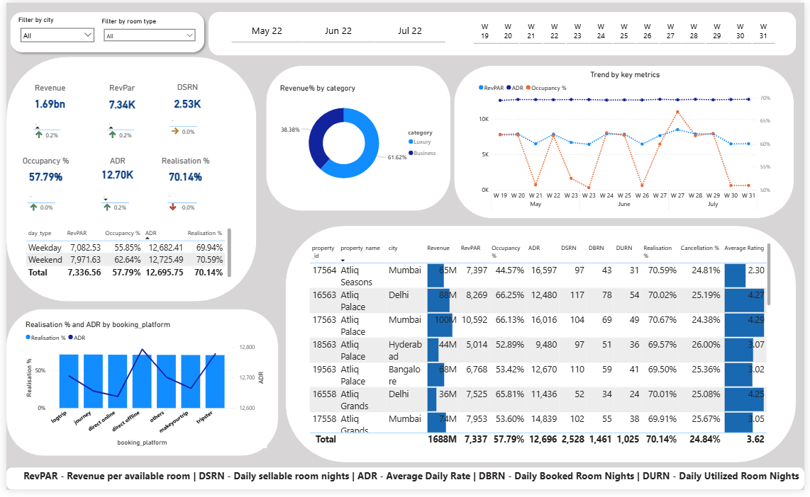

# Hospitality KPI Dashboard – Power BI

This Power BI dashboard presents a data-driven overview of hotel performance metrics, helping business users understand revenue patterns, booking behaviors, and room utilization across cities and room types.

Built as part of a guided challenge from the Codebasics YouTube channel, this project reflects my growing expertise in DAX, Power BI visuals, and end-to-end dashboard development. While resources and instructions were provided, I completed the dashboard independently, working through key modeling and visualization decisions on my own.

## Project Summary

The dataset includes hotel performance data from May to July, focusing on core KPIs like revenue, booking nights, and occupancy. The dashboard was designed to support hotel managers and analysts in understanding:

- Revenue trends over time
- Platform-specific booking behavior
- Key business metrics like RevPAR, ADR, and Occupancy %

## Metrics Included

- RevPAR – Revenue per Available Room  
- ADR – Average Daily Rate  
- DSRN – Daily Sellable Room Nights  
- DBRN – Daily Booked Room Nights  
- DURN – Daily Utilized Room Nights  
- Occupancy %, Revenue, and Week-over-Week % Change

All measures include tooltips with time-series trends for richer context.

## Dashboard Features

- Interactive filters by City, Room Type, Month, and Week
- KPI cards with tooltip insights
- Pie chart showing revenue by room category (Luxury vs Business)
- Line chart tracking RevPAR, ADR, and Occupancy % over time
- Line and stacked column chart showing booking platform trends
- Weekday vs weekend comparison table
- Hotel-wise table with ratings and performance metrics

All visuals are connected through filters for a fully interactive experience.

## Tools and Techniques

- Power BI Desktop
- DAX (Calculated Columns and Measures)
- Data Modeling and Relationships
- Time Intelligence
- Tooltip Customization
- UX Design Principles for Dashboards

##File

`[Hospitality KPI dashboard.pbix](https://github.com/Athira2218/Hospitality-KPI-Dashboard/raw/main/Hospitality%20KPI%20dashboard.pbix)` – Main Power BI file (viewable in Power BI Desktop)

## What I Learned

As someone transitioning into data analytics, this project helped solidify my understanding of business-focused KPIs and dashboard design. I gained hands-on experience with:

- Creating visuals aligned with stakeholder goals
- Writing DAX to calculate and format complex metrics
- Designing dashboards that are both insightful and easy to navigate

It was also a valuable opportunity to interpret partially guided instructions and take full ownership of the final output.

---

#Dashboard preview

This project is part of my analytics portfolio and intended for hiring or recruiter review.
